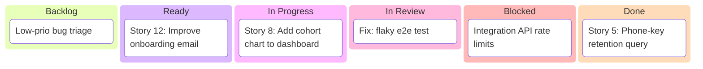

# Vibe Kanban: Sprint Board Setup

This guide sets up a lightweight Kanban for sprints using BMAD-METHOD and GitHub Projects. It works even without external tools and keeps the “vibe” clear: fast flow, minimal WIP, high signal.

## Columns (Status single-select)
- Backlog: Not ready; needs refinement.
- Ready: Clear scope; acceptance criteria defined.
- In Progress: Being implemented; 1–2 WIP per dev.
- In Review: Code review and/or QA gate in progress.
- Blocked: Explicit owner + unblock action.
- Done: Merged and validated.

## Labels (examples)
- Type: `type:feat`, `type:fix`, `type:docs`, `type:chore`, `type:refactor`, `type:test`
- Priority: `P0`, `P1`, `P2`
- Size: `S`, `M`, `L`

## Sprint cadence
- 1 or 2 weeks. Define Definition of Ready and Done explicitly.
- Planning: pick Ready items; set `Sprint` iteration and initial Status=In Progress.
- Daily: keep WIP low; move cards across Status only when really ready.
- Review/Retro: use BMAD Scrum Master tasks for retro notes and next sprint adjustments.

## GitHub Project (Kanban) quick setup
1) Authenticate GH CLI: `gh auth login` (ensure token has `project` scope).
2) Create project: `gh project create --owner <ORG_OR_USER> --title "Vibe Kanban"`
3) Add fields (single-select):
   - `gh project field-create <NUMBER> --owner <ORG_OR_USER> --name Status --data-type SINGLE_SELECT --options "Backlog,Ready,In Progress,In Review,Blocked,Done"`
   - `gh project field-create <NUMBER> --owner <ORG_OR_USER> --name Sprint --data-type ITERATION`
   - `gh project field-create <NUMBER> --owner <ORG_OR_USER> --name Priority --data-type SINGLE_SELECT --options "P0,P1,P2"`
   - `gh project field-create <NUMBER> --owner <ORG_OR_USER> --name Size --data-type SINGLE_SELECT --options "S,M,L"`
4) Link repo: `gh project link --owner <ORG_OR_USER> --project <NUMBER> --repo <ORG_OR_USER>/<REPO>`
5) In the project web UI, create a “Board” view grouped by `Status`.

## Mermaid Kanban (doc-only)
Use this in planning docs for snapshotting the board state.

Tip: Use BMAD agents from `AGENTS.md` (e.g., `sm`, `po`, `qa`) to draft stories, acceptance criteria, and QA gates, then track them on this board.

